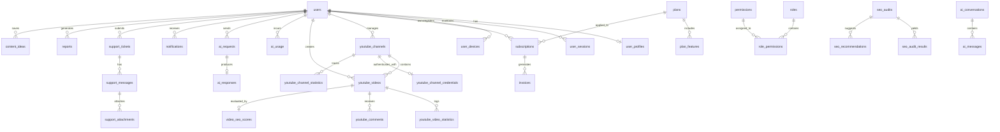

# VidPulse AI Platform - Complete Database ER Diagram

Below is the entity-relationship diagram for the production PostgreSQL database of the VidPulse AI platform.

```mermaid
erDiagram
    users ||--o| user_profiles : "has"
    users ||--o{ user_sessions : "maintains"
    users ||--o{ user_devices : "registers"
    users ||--o{ subscriptions : "owns"
    users ||--o{ youtube_channels : "manages"
    users ||--o{ youtube_videos : "creates"
    users ||--o{ ai_usage : "incurs"
    users ||--o{ ai_requests : "sends"
    users ||--o{ notifications : "receives"
    users ||--o{ support_tickets : "submits"
    users ||--o{ reports : "generates"
    users ||--o{ content_ideas : "saves"

    roles ||--o{ role_permissions : "contains"
    permissions ||--o{ role_permissions : "assigned_to"

    subscriptions ||--o{ invoices : "generates"
    plans ||--o{ plan_features : "includes"
    plans ||--o{ subscriptions : "applied_to"

    youtube_channels ||--o{ youtube_videos : "contains"
    youtube_channels ||--o| youtube_channel_credentials : "authenticates_with"
    youtube_channels ||--o{ youtube_channel_statistics : "tracks"

    youtube_videos ||--o{ youtube_video_statistics : "logs"
    youtube_videos ||--o{ youtube_comments : "receives"
    youtube_videos ||--o| video_seo_scores : "evaluated_by"

    seo_audits ||--o{ seo_audit_results : "yields"
    seo_audits ||--o{ seo_recommendations : "suggests"

    ai_requests ||--o| ai_responses : "produces"
    ai_conversations ||--o{ ai_messages : "contains"

    support_tickets ||--o{ support_messages : "has"
    support_messages ||--o{ support_attachments : "attaches"
```
